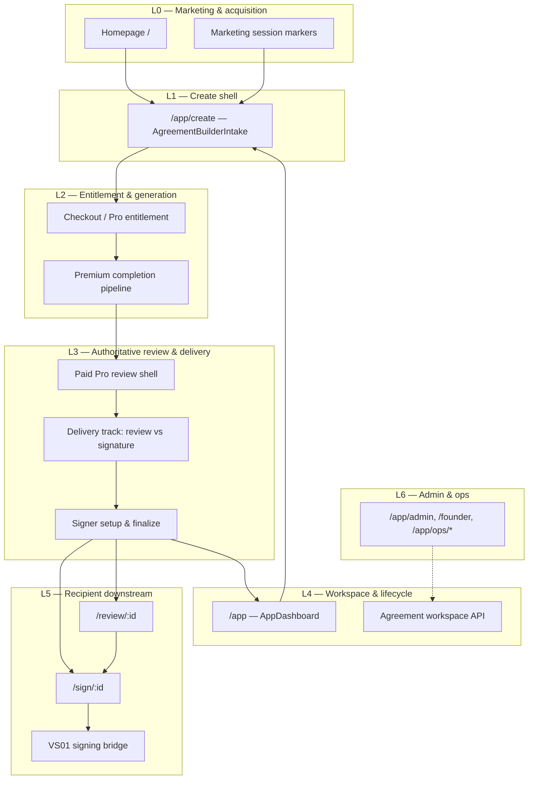
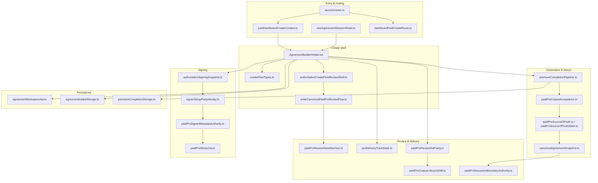

# LawDog System Architecture

**Status:** Root architecture document (authoritative for product screenflows)  
**Audience:** Engineers, QA, and agents working on LawDog UI, create flows, workspace, and recipient surfaces  
**Last updated:** 2026-07-08

---

## Authority & document hierarchy

This document is the **root** of the LawDog product architecture tree. All screenflow-specific documents (homepage, first-time Pro create, dashboard workspace, dashboard paid-create, admin, recipient downstream) **must reference this file** and must not redefine concepts established here.

| Layer | Document | Relationship |
|-------|----------|--------------|
| **Root (this file)** | `docs/architecture/LAWDOG_SYSTEM_ARCHITECTURE.md` | Product layers, domain objects, dependency graph, lifecycle, markers, persistence, invariants |
| **Domain model** | `docs/architecture/LAWDOG_DOMAIN_MODEL.md` | Canonical object definitions: ownership, lifetime, persistence, mutation authority |
| **Interaction & data flow** | `docs/architecture/LAWDOG_INTERACTION_DATA_FLOW.md` | How data moves: lifecycle stages, one-way gates, mutation choreography, fail-closed rules |
| **Architecture decisions** | `docs/architecture/LAWDOG_ARCHITECTURE_DECISIONS.md` | Why key boundaries exist (ADRs); read before changing create/review/sign flows |
| Screenflow children | `docs/architecture/screenflows/*` (planned) | Entry-specific choreography; cite § here for shared concepts |
| CLAW protocol | `docs/CLAW_CANON.md`, `docs/protocol/*`, `docs/architecture/SERVICE_BOUNDARIES.md` | Proof, receipts, anchoring — orthogonal to UI choreography |
| Living implementation spec | Module headers + `paidProTest4xx`–`paidProTest5xx` regression tests | Executable truth when docs lag; must not contradict this root |

When this document and a screenflow child disagree, **this document wins** unless an explicit ADR or `CLAW_CANON.md` protocol rule overrides.

---

## 1. Product layers

LawDog is a commercial agreement product built on the CLAW proof stack. The **product** is organized in six logical layers. Each layer has distinct entry routes, persistence, and invariants.



### Layer definitions

| Layer | Name | Primary routes | Responsibility |
|-------|------|----------------|----------------|
| **L0** | Marketing & acquisition | `/`, marketing CTAs | Hero intake prefill, paywall attribution, session bootstrap before auth |
| **L1** | Create shell | `/app/create` | Two-pane intake, `createFlowPhase` orchestration, route marker interpretation |
| **L2** | Entitlement & generation | Checkout return, dashboard paid-create bootstrap | Pro entitlement latch, `runPremiumCompletion`, server full-draft acceptance |
| **L3** | Authoritative review & delivery | In-create review chrome | SoT freeze, review corpus parity, delivery-track choice, signer metadata |
| **L4** | Workspace & lifecycle | `/app` | Persisted agreement rows, folders, archive, post-create navigation |
| **L5** | Recipient downstream | `/review/:id`, `/sign/:id` | Tokenized recipient surfaces, VS01 handoff, signing corpus binding |
| **L6** | Admin & ops | `/app/admin`, `/founder`, ops routes | Operator tools; does not participate in paid-create state machine |

**Cross-cutting:** `lawdog_entry_context`, org context (`claw_org_id`), and `claw_active_agreement_generation_id_v1` span L0–L4.

---

## 2. Domain objects

Domain objects are the stable nouns shared across screenflows. Implementation types live in cited modules; this section defines **semantic** ownership.

### 2.1 Agreement (persisted)

| Field concept | Owner | Notes |
|---------------|-------|-------|
| `AgreementDraft` | Server + `agreementWorkspaceApi.ts` | Canonical persisted shape: parties, versions, audit_log, workspace metadata |
| `WorkspaceIndexAgreement` | Dashboard list row | Denormalized index; may use `supabase_fallback` when draft JSON unavailable |
| `generation_id` | `agreementGenerationId.ts` | Session-scoped active generation; ties create shell to server draft |

**Invariant:** A persisted agreement row is the **system of record** after create-flow draft persist succeeds. In-create SoT is a **freeze** of generation output, not a second agreement.

### 2.2 Draft corpus (pre-persist / in-flight)

| Object | Module | Lifecycle |
|--------|--------|-----------|
| **Working draft text** | Intake + generation pipeline | Mutable until SoT establishment |
| **Pipeline accepted corpus** | `paidProPipelineAcceptedCorpus.ts` | Pre-SoT render fallback from generation acceptance |
| **Server full draft** | API `premium_full_draft` | Authoritative generation output from backend quality gate |

### 2.3 Paid Pro Source of Truth (SoT)

```typescript
// paidProSourceOfTruthState.ts — semantic contract
type PaidProSourceOfTruth = {
  text: string;
  hash: string;
  accepted_at: number;
  source: "server_full_draft";
  reviewSessionId?: string;
  signerManifestHash?: string;
};
```

| Property | Rule |
|----------|------|
| **Authority** | Single in-memory module state (`replacePaidProSourceOfTruth`) |
| **Minimum body** | `hasPaidProSourceOfTruth()` requires ≥500 chars |
| **Immutability** | Frozen at establishment; revision requires explicit user-driven re-generation path |
| **Surfaces** | `PaidProDocumentSurface`: display, copy, review, finalized, signer_setup, vs01 |

### 2.4 Canonical agreement snapshot

`canonicalAgreementSnapshot.ts` — display-boundary freeze with integrity gates (placeholder scan, clause family, commercial specificity, execution block count). Sources include `server_full_document_text`, `paid_pro_review_render`, `finalized_signing`, etc.

**Relationship:** SoT is the **paid acceptance anchor**; canonical snapshot is the **render-safe projection** applied at document boundaries.

### 2.5 Authoritative signing snapshot

`authoritativeSigningSnapshot.ts` — post-finalize signing corpus. Distinct from review SoT:

- Established when signer metadata is finalized (`paidProSignerMetadataFinalizedLatch`)
- Drives signing prep and VS01 bridge
- `isPostSignerMetadataFreezeActive()` gates edit vs read-only signer surfaces

### 2.6 Party & signer identity

| Concept | Module | Rule |
|---------|--------|------|
| **Party slot** | `partySlotIdentityNormalize.ts`, intake | Entity name, role, notice address |
| **Signer metadata** | `paidProSignerMetadataAuthority.ts`, `signerSetupPartyIdentity.ts` | Human signer ≠ party entity; contamination blocked |
| **Labeled party blocks** | `labeledPartyBlockParse.ts` | Structural parse for render tokens |

### 2.7 Delivery track

| Concept | Module | Values |
|---------|--------|--------|
| `proDeliveryTrackSelected` | `proDeliveryTrackState.ts` | `"review"` \| `"signature"` |
| `effectivePremiumSendMode` | `AgreementBuilderIntake.tsx` | Derived; review-first unless signature prep latched |
| `signaturePreparationRequested` | Create shell state | Releases signing corpus freeze for prep UI |

**TEST577 contract:** `paidProSignaturePrepIntentLatched` preserves signature track through inline signer setup when `signaturePreparationRequested` is deliberately cleared.

### 2.8 Review session & generation audit

| Object | Module |
|--------|--------|
| Premium review route | `premiumReviewRouteTypes.ts` |
| Generation call audit | `paidProPremiumGenerationCallAudit.ts` |
| Corpus lifecycle diff | `paidProCorpusLifecycleDiff.ts` |
| Review SoT parity | `paidProReviewSotParity.ts` |

### 2.9 Recipient artifacts

| Object | Route / module |
|--------|----------------|
| Review invite | `/review/:id` + recipient access API |
| Signature session | `/sign/:id` |
| VS01 bridge handoff | `claw_agreement_vs01_bridge_handoff_v1` |

---

## 3. Module dependency graph

Dependencies flow **downward** (higher layers depend on lower). Leaf modules (state bags, pure predicates) must not import render routers or `AgreementBuilderIntake`.



### Dependency rules

1. **`paidProSourceOfTruthState.ts`** is a leaf — no render corpus imports (hot-path parity).
2. **`paidProReviewStateMachine.ts`** is pure — no React; consumed by shell routing.
3. **`proDeliveryTrackState.ts`** is pure — track resolution only; latched state owned by `AgreementBuilderIntake`.
4. **Document body routing** (`paidProDocumentBodyRouter.tsx`) reads authority modules; does not establish SoT.
5. **Backend** (`agreements_v2_api.py`, `premium_full_draft_quality_gate.py`) owns generation quality gate; frontend accepts or fails closed.

### Forbidden edges

| From | To | Reason |
|------|-----|--------|
| Proof/receipt builders | LLM providers | `SERVICE_BOUNDARIES.md`, ADR-002 |
| Starter preview surface | Paid authoritative render | `paidProReviewStateMachine` fail-closed |
| Signer slot | Party entity name | `signer-slot-contamination-blocked` |
| Parity audit | Silent corpus rewrite | Allowed deltas only (`paidProCorpusLifecycleDiff`) |

---

## 4. Lifecycle & state machines

LawDog create uses **three coupled state machines** plus **explicit latches**. They must be reasoned about together.

### 4.1 Create flow production phase

Defined in `createFlowTypes.ts` — explicit UI phases for the two-pane create shell.

```
capturing_input
    → generating_draft
    → [complexity_choice_required | multi_party_pro_required]  (gates)
    → draft_ready_for_review
    → signer_setup_required
    → [finalizing_final_review | guided_final_review | updated_agreement_ready]
    → recipient_setup_required
    → ready_to_send
```

| Phase | User-visible intent |
|-------|---------------------|
| `capturing_input` | Intake form active |
| `generating_draft` | Premium completion / server draft in flight |
| `draft_ready_for_review` | Authoritative body available; review chrome eligible |
| `signer_setup_required` | Inline signer metadata form |
| `recipient_setup_required` | Signing prep / link generation |
| `ready_to_send` | Send CTA armed |

Helper: `isCreateFlowPastCapture(phase)` — true once past intake/generation gates.

### 4.2 Paid Pro review state

Defined in `paidProReviewStateMachine.ts` — **fail-closed** routing for paid surfaces.

```
NOT_PAID ──(checkout / QA bypass)──► GENERATING
                                        │
                    ┌───────────────────┼───────────────────┐
                    ▼                   ▼                   ▼
           AUTHORITATIVE_READY   FAILED_PREMIUM_CORPUS   (hold GENERATING
                    │                   │                during in-flight gen)
                    │                   └── recoverable; never starter degrade
                    └── valid corpus + body len > 0
```

| State | Blocks starter? | Blocks review render? | Allows recipient setup? |
|-------|-----------------|----------------------|-------------------------|
| `NOT_PAID` | No | — | No |
| `GENERATING` | Yes | Yes (spinner/recover) | No |
| `AUTHORITATIVE_READY` | Yes | No | Yes (when delivery track permits) |
| `FAILED_PREMIUM_CORPUS` | Yes | Yes (recovery UI) | No |

**Key resolver inputs:** `premiumCheckoutCompleted`, `hasValidAuthoritativeCorpus`, `premiumGenerationInFlight`, `authoritativeBodyLen`, `signerMetadataEditActive`.

### 4.3 Delivery track state (derived)

```
                    ┌─────────────────────────────────────┐
                    │  User picks delivery track on review │
                    └─────────────────┬───────────────────┘
                                      ▼
              ┌───────────────────────────────────────────────┐
              │  resolveProDeliveryTrackSelected()             │
              │  inputs: effectivePremiumSendMode,             │
              │          signaturePreparationRequested,        │
              │          paidProSignaturePrepIntentLatched     │
              └─────────────────┬─────────────────────────────┘
                                ▼
                    ┌───────────┴───────────┐
                    ▼                       ▼
              selectedTrack:          selectedTrack:
                 "review"               "signature"
                    │                       │
                    ▼                       ▼
         Send for review path      Prepare for signing path
         (TEST570 gate)            (TEST575 advance, TEST577 latch)
```

**Dashboard paid-create default:** Review track unless user explicitly selects signature (`paidProReviewDefaultsToReviewTrack()`).

### 4.4 Latch registry (React + module)

Latches are **sticky booleans** that prevent derived state from collapsing user intent during multi-step UI.

| Latch | Owner component | Set when | Clear when |
|-------|-----------------|----------|------------|
| `paidProInlineSignerSetupLatched` | `AgreementBuilderIntake` | Inline signer form mounted | Teardown / review re-entry |
| `paidProSignerMetadataFinalizedLatch` | `AgreementBuilderIntake` | Signer finalize succeeds | User clicks Edit (guarded) |
| `paidProSignaturePrepIntentLatched` | `AgreementBuilderIntake` | User picks signature track | User picks review / SoT teardown |
| `signaturePreparationRequested` | Create shell | Signing prep explicitly requested | Track revert / teardown |

**Invariant:** Latches are **session-scoped UI state**, not persisted to server. They must not contradict established SoT hash.

### 4.5 End-to-end lifecycle (dashboard paid-create reference)

The **dashboard paid-create (DPC)** flow is the reference choreography for L1–L3:

```
1. User: Dashboard → Create Agreement
2. Marker: write claw_paid_dashboard_create_context_v1
3. Route: /app/create + dashboardPaidCreateRoute bootstrap
4. Intake: planDashboardPaidCreateSubmitBootstrap
5. Generate: runPremiumCompletion → server full draft
6. Freeze: establishPaidProSourceOfTruth (source: server_full_draft)
7. Review: enterCanonicalPaidProReviewFlow(dashboard_paid_create)
8. Decision: delivery track (review vs signature) — TEST570
9. Signer: inline setup → finalize — TEST575
10. Advance: signature prep if track latched — TEST577
11. Persist: workspace row + optional recipient handoff
```

First-time Pro create differs at steps 2–4 (checkout marker, `post_checkout_apply_success`, `entitled_rewrite` source tag) but **converges at step 6**.

---

## 5. Session marker ownership

Session markers are `sessionStorage` keys with **single-owner write semantics**. A marker's owner flow is responsible for write, scoped read, and clear on cross-flow entry.

### 5.1 Marker matrix

| Key | Owner flow | Written | Cleared by |
|-----|------------|---------|------------|
| `claw_paid_dashboard_create_context_v1` | L4 → L1 dashboard create | Dashboard "Create Agreement" | Homepage entry, `newAgreementSessionReset`, org mismatch |
| `claw_hero_intake_prefill_v1` | L0 homepage | Hero CTA submit | Create consume or reset |
| `claw_marketing_session_v1` | L0 marketing | Landing attribution | Session reset |
| `lawdog_entry_context` | Cross-flow | Any entry bootstrap | Explicit navigation reset |
| `claw_authenticated_workspace_session` | L4 workspace | Post-auth dashboard load | Logout / reset |
| `claw_paid_premium_completion_session_v1` | L2 checkout | Stripe return / QA bypass | Pro generation complete or explicit starter continue |
| `claw_premium_completion_snapshot_v1` | L2 generation | `premiumCompletionStorage` | Completion teardown |
| `claw_direct_create_bootstrap_attempted_v1` | L1 cold entry | Direct `/app/create` bootstrap | Successful bootstrap or fatal |
| `claw_agreement_vs01_bridge_handoff_v1` | L5 VS01 | Post-sign handoff | VS01 consume |
| `claw_agreement_creator_intake_v1` | L1 intake | Intake persist | Reset / successful handoff |
| `claw_agreement_create_review_resume_v1` | L1 create | Review resume | Phase advance |
| `claw_agreement_create_review_draft_ready_v1` | L1 create | Draft ready latch | SoT establishment |
| `claw_agreement_create_full_draft_marker_v1` | L1 create | Full draft accepted | Corpus superseded |
| `claw_active_agreement_generation_id_v1` | Cross-flow | Generation start | New session / reset |
| `claw_pro_intent_session_v1` | L2 entitlement | Pro intent declared | Entitlement complete |
| `claw_pro_entitlement_session_v1` | L2 entitlement | Checkout settled | Session reset |
| `claw_free_starter_session_v1` | L1 starter | Free generation | Pro upgrade |
| `claw_org_id` | Auth | Org selection | Org switch |
| `claw_paywall_attribution_v1` | L0 marketing | Paywall impression | — |
| `claw_paid_pro_vs01_post_sign_v1` | L5 VS01 | Post-sign state | Handoff complete |
| `claw_authoritative_agreement_version_v1` | L3 continuity | Version bump | Agreement superseded |

### 5.2 Ownership rules

1. **Homepage clears dashboard marker** — public entry must not inherit dashboard paid-create context (`paidDashboardCreateContext.ts` header).
2. **One create context per org** — dashboard marker scoped to `claw_org_id` + `/app/create` read.
3. **Markers are not SoT** — corpus authority lives in module state (SoT) and server draft, not sessionStorage text.
4. **Bootstrap idempotency** — `claw_direct_create_bootstrap_attempted_v1` prevents duplicate cold-entry bootstrap (TEST543).
5. **Entitlement triad** — `pro_intent`, `pro_entitlement`, `free_starter` are mutually exclusive per `paidProSessionEligibility.ts`.

### 5.3 Marker ↔ phase coupling

| Marker present | Expected phase region |
|----------------|----------------------|
| `claw_paid_dashboard_create_context_v1` | `capturing_input` → `draft_ready_for_review` |
| `claw_paid_premium_completion_session_v1` | `generating_draft` → `AUTHORITATIVE_READY` |
| `claw_agreement_create_review_draft_ready_v1` | `draft_ready_for_review` |
| SoT established (module) | `draft_ready_for_review` + `AUTHORITATIVE_READY` |
| `paidProSignerMetadataFinalizedLatch` (React) | `recipient_setup_required` eligible |

---

## 6. Persistence boundaries

| Tier | Store | Durability | Holds |
|------|-------|------------|-------|
| **T0 — Ephemeral React** | Component state, latches | Tab session | UI intent, inline form drafts, track picks |
| **T1 — Module singleton** | `paidProSourceOfTruthState`, signing snapshot modules | Tab session (JS heap) | Accepted corpus, hashes, freeze timestamps |
| **T2 — sessionStorage** | Marker keys (§5) | Tab session, survives refresh | Bootstrap context, entitlement, resume tokens |
| **T3 — Server draft API** | `agreementWorkspaceApi` | Durable per org | `AgreementDraft`, versions, audit_log |
| **T4 — Recipient tokens** | URL token + server | Durable, scoped | Review/sign access without full auth |
| **T5 — Proof layer** | Document service, receipts | Immutable append | `content_sha256`, sign packets, timeline |

### Boundary contracts

```
┌─────────────────────────────────────────────────────────────┐
│  T0/T1 — In-create authority (lost on hard navigation      │
│          without resume markers)                             │
│  • PaidProSourceOfTruth                                      │
│  • AuthoritativeSigningSnapshot                              │
│  • Delivery track latches                                    │
└──────────────────────────┬──────────────────────────────────┘
                           │ explicit persist / finalize
                           ▼
┌─────────────────────────────────────────────────────────────┐
│  T3 — Agreement workspace (system of record)                 │
│  • parties[], signer metadata (post-sync)                    │
│  • review_sent_at, workspace metadata                      │
└──────────────────────────┬──────────────────────────────────┘
                           │ handoff
                           ▼
┌─────────────────────────────────────────────────────────────┐
│  T4/T5 — Recipient & proof (downstream)                      │
│  • Tokenized review/sign surfaces                            │
│  • Bound document hash + attestation                         │
└─────────────────────────────────────────────────────────────┘
```

| Transition | Required gate |
|------------|---------------|
| T1 → T3 (draft persist) | Generation acceptance + draft API success |
| T1 → T1 (signing snapshot) | Signer metadata finalize + parity pass |
| T3 → T4 (send review/sign) | Delivery track decision + recipient setup complete |
| Any → T0 clear | `newAgreementSessionReset` or explicit teardown effect |

**Rule:** Never treat `sessionStorage` corpus snapshots as authoritative over in-memory SoT when both exist and hashes disagree — SoT module wins.

---

## 7. Canonical invariants

These invariants are **must-not-break** contracts. Regression tests (`paidProTest4xx`–`paidProTest5xx`) encode them; module headers cite test IDs.

### 7.1 Corpus & authority

| ID | Invariant | Enforcement |
|----|-----------|-------------|
| **INV-SOT-01** | Frozen Paid Pro SoT is immutable without explicit revision path | `paidProSourceOfTruthState`, establishment guards |
| **INV-SOT-02** | `hasPaidProSourceOfTruth()` requires ≥500 char body | Prevents empty authoritative render |
| **INV-PARITY-01** | Review render corpus must match SoT modulo **allowed deltas** | `paidProReviewSotParity.ts` |
| **INV-PARITY-02** | Allowed deltas classified only via `paidProCorpusLifecycleDiff.ts` | `notice_contact_hydration_only`, display normalization, etc. |
| **INV-BOUNDARY-01** | One execution block per document | `paidProExecutionBlockAuthority.ts` |
| **INV-BOUNDARY-02** | Unresolved render tokens blocked at document boundary | `paidProDocumentBoundaryAuthority.ts`, TEST563 |

### 7.2 Paid surface routing

| ID | Invariant | Enforcement |
|----|-----------|-------------|
| **INV-PAID-01** | Post-checkout surface never silently degrades to free starter | `paidProReviewStateMachine.ts` |
| **INV-PAID-02** | `FAILED_PREMIUM_CORPUS` is recoverable, not a starter escape hatch | Recovery UI only |
| **INV-PAID-03** | `authoritativeBodyLen === 0` forbids `AUTHORITATIVE_READY` | Prevents `authoritativeLen: 0` violations |
| **INV-PAID-04** | Signer metadata edit active holds corpus — no fail-downgrade | `signerMetadataEditActive` resolver input |

### 7.3 Identity & placeholders

| ID | Invariant | Enforcement |
|----|-----------|-------------|
| **INV-ID-01** | Signer ≠ party entity (no slot contamination) | `signerSetupPartyIdentity.ts` |
| **INV-ID-02** | No phantom parties in render | Party slot normalization |
| **INV-ID-03** | Placeholder weakening forbidden | `agreementTemplatePlaceholderSafety.ts` |
| **INV-ID-04** | Legal form leakage blocked in identity display | TEST550 |

### 7.4 Delivery & signing choreography

| ID | Invariant | Enforcement |
|----|-----------|-------------|
| **INV-DEL-01** | Dashboard paid-create: delivery track decision before signer setup | TEST570 |
| **INV-DEL-02** | Prepare for signing advances phase, not review loop | TEST575 |
| **INV-DEL-03** | Signature track preserved through inline signer setup | TEST577, `paidProSignaturePrepIntentLatched` |
| **INV-DEL-04** | Post-finalize review surface parity with pre-finalize | TEST576 |
| **INV-DEL-05** | Signer finalize latch sticky until explicit Edit | `paidProStickyCta.ts` |

### 7.5 Generation & audit

| ID | Invariant | Enforcement |
|----|-----------|-------------|
| **INV-GEN-01** | Premium generation audited before canonical freeze | `paidProPremiumGenerationCallAudit.ts`, TEST552 |
| **INV-GEN-02** | Compound render tokens gated | TEST551 |
| **INV-GEN-03** | Address render tokens resolve intake fallback | TEST564–566 |

### 7.6 Cross-flow bootstrap

| ID | Invariant | Enforcement |
|----|-----------|-------------|
| **INV-BOOT-01** | Homepage entry clears dashboard paid-create marker | `paidDashboardCreateContext` |
| **INV-BOOT-02** | Direct create bootstrap order deterministic | TEST543, TEST544 |
| **INV-BOOT-03** | Fatal markers surface before retry loops | TEST545 |

### 7.7 Parity violation taxonomy

When parity audit fails, classify via `paidProCorpusLifecycleDiff.ts`:

- **Allowed:** notice contact hydration, display normalization confined to notice stanzas, signer metadata application post-finalize
- **Forbidden:** body substance change, party count change, execution block duplication, unresolved mustache tokens in user-visible surfaces

---

## 8. Screenflow child documents (planned)

Do **not** duplicate §2–§7 in child docs. Children cover entry-specific choreography only.

| Planned doc | Screenflow | Entry |
|-------------|------------|-------|
| `screenflows/LAWDOG_HOMEPAGE.md` | L0 → L1 | `/` |
| `screenflows/LAWDOG_FIRST_TIME_PRO_CREATE.md` | L0 → L2 → L3 | Starter → checkout |
| `screenflows/LAWDOG_DASHBOARD_WORKSPACE.md` | L4 | `/app` |
| `screenflows/LAWDOG_DASHBOARD_PAID_CREATE.md` | L4 → L1 → L3 | Dashboard create (reference) |
| `screenflows/LAWDOG_ADMIN.md` | L6 | Admin routes |
| `screenflows/LAWDOG_RECIPIENT_DOWNSTREAM.md` | L5 | `/review`, `/sign` |
| `screenflows/LAWDOG_SCREENFLOW_INDEX.md` | Index | Links + coverage matrix |

Each child must begin with:

```markdown
> **Parent:** [LawDog System Architecture](../LAWDOG_SYSTEM_ARCHITECTURE.md)
```

---

## 9. Relationship to CLAW protocol documentation

| Concern | LawDog (this tree) | CLAW protocol |
|---------|-------------------|---------------|
| UI choreography | ✅ | — |
| Agreement drafting UX | ✅ | — |
| Document bytes & hash | Boundary (T5 handoff) | `SERVICE_BOUNDARIES.md` §1 |
| E-sign attestation | Boundary (T4→T5) | `SERVICE_BOUNDARIES.md` §2 |
| Receipts & anchoring | — | `CLAW_CANON.md`, `docs/protocol/*` |
| AI guardrails | Generation input only | `AI-GUARDRAILS.md`, ADR-002 |

LawDog product code **must not** import LLM providers into proof/receipt code paths.

---

## 10. Route taxonomy (quick reference)

From `frontend/src/launch/routes.ts` and create modules:

| Route | Layer | Primary component |
|-------|-------|-------------------|
| `/` | L0 | `LaunchHomePage` |
| `/app` | L4 | `AppDashboard` |
| `/app/create` | L1 | `AgreementBuilderIntake` |
| `/app/admin`, `/founder` | L6 | Admin shells |
| `/review/:id` | L5 | Recipient review |
| `/sign/:id` | L5 | Recipient sign |

---

## Appendix A — Key module index

| Concern | Module path |
|---------|-------------|
| Create shell | `frontend/src/components/agreements/AgreementBuilderIntake.tsx` |
| Production phases | `frontend/src/components/agreements/createFlowTypes.ts` |
| Dashboard marker | `frontend/src/launch/paidDashboardCreateContext.ts` |
| Session reset | `frontend/src/launch/newAgreementSessionReset.ts` |
| Premium pipeline | `frontend/src/components/agreements/premiumCompletionPipeline.ts` |
| SoT establishment | `frontend/src/components/agreements/paidProSourceOfTruth.ts` |
| SoT state (leaf) | `frontend/src/components/agreements/paidProSourceOfTruthState.ts` |
| Review entry | `frontend/src/components/agreements/enterCanonicalPaidProReviewFlow.ts` |
| Review shell | `frontend/src/components/agreements/authoritativeCreateFlowReviewShell.ts` |
| Paid review FSM | `frontend/src/components/agreements/paidProReviewStateMachine.ts` |
| Delivery track | `frontend/src/components/agreements/proDeliveryTrackState.ts` |
| Signing snapshot | `frontend/src/components/agreements/authoritativeSigningSnapshot.ts` |
| Parity audit | `frontend/src/components/agreements/paidProReviewSotParity.ts` |
| Corpus diff | `frontend/src/components/agreements/paidProCorpusLifecycleDiff.ts` |
| Workspace API | `frontend/src/agreement/agreementWorkspaceApi.ts` |
| Backend gate | `backend/agreements/premium_full_draft_quality_gate.py` |

---

## Appendix B — Revision history

| Date | Change |
|------|--------|
| 2026-07-08 | Initial root architecture — product layers, domain objects, dependency graph, lifecycle, markers, persistence, invariants |
